# Docker overview

[Docker overview](https://docs.docker.com/get-started/overview)

Docker 를 사용하면 애플리케이션과 동일한 방식으로 인프라를 관리하고 인프라에서 분리하여 소프트웨어를 신속하게 제공할 수 있다. 코드 작성 → 프로덕션 실행 사이의 지연 시간을 크게 줄일 수 있다.

### Docker platform

Docker 는 컨테이너 라는 느슨하게 독립된 환경에서 어플리케이션을 패키징, 실행 하는 기능을 제공한다. 격리와 보안을 통해 주어진 호스트에서 동시에 많은 컨테이너를 실행할 수 있다. 호스트에 설치된 것들에 의존하지 않고 컨테이너에는 어플리케이션을 실행하는 데 필요한 모든 것이 설치되어 있다. 작업 중에도 쉽게 컨테이너를 공유할 수 있고, 공유하는 모든 사람이 동일한 방식으로 작동하는 동일한 컨테이너를 얻는다.

도커는 container 의 lifecycle 을 관리하는 플랫폼과 도구를 제공한다.

### What can I use Docker for?

Fast, consistent delivery of your applications

local container 를 사용해서 표준화된 환경에서 개발할 수 있게 한다. CI/CD work flow 에 적합하다.

- local code 작성 → 도커 컨테이너로 동료와 작업공유
- 도커로 애플리케이션을 테스트에 푸시하고 자동/수동 테스트 실행
- 버그 수정 수 테스트 환경에 재배포

반응형 배포 및 확장 (혼합 환경에서 실행가능, 거의 실시간 확장/축소 가능)

동일한 하드웨어에서 더 많은 워크로드 (하이퍼바이저보다 더 가볍고 빨라서 서버를 더 많이 쓸 수 있다. 적은 리소스로 더 많은 작업 가능)

## Docker architecture

서버 - 클라이언트 아키텍쳐 사용

도커 클라이언트는 도커 컨테이너를 빌드, 실행, 배포하는 Docker daemon 과 통신한다. 클라이언트와 데몬을 같은 system에서 실행될 수도, client 를 원격 daemon 에 연결할 수도 있다. UNIX socket 이나 network inferface 를 통해서 REST API로 소통한다. 또 다른 Docker client 는 Docker compse 이다. 도커 컴포즈는 컨테이너들의 셋으로 구성된 어플리케이션으로 작업할 수 있다.

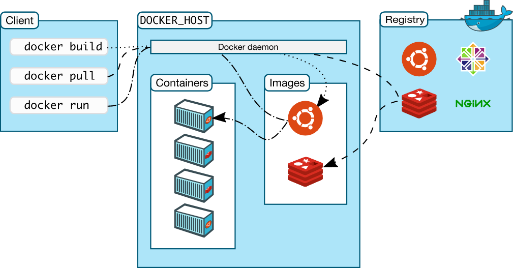

### docker daemon

`dockerd` - Docker API request 를 listen 하고 image, containers, networks, volumes 같은 도커 오브젝트들을 관리한다. 다른 daemon 과 통신해서 도커 서비스를 관리할 수도 있다.

### docker client

`docker` - 도커와 유저가 상호작용하는 일반적인 방법이다. `docker run` 같은 커맨드를 입력했을 때, docker client 가 `dockerd` 로 커맨드를 보낸다. `docker` 커맨드는 Docker API 를 사용한다. 여러 개의 daemon 과 소통할 수 있다.

### docker registries

Docker image 를 저장한다. Docker Hub 는 누구나 사용할 수 있는 public registry 이다. 기본으로 도커허브에서 이미지를 찾는다.

`docker pull` 이나 `docker run` 커맨드를 사용할 때, 요청된 이미지는 configured registry 에서 내려받는다. `docker push` 를 사용하면 configured registry 로 이미지가 올라간다.

### docker objects

images, containers, networks, volumes, plugins 등..

### images

도커 컨테이너를 만드는 데 사용되는 read-only template. 한 이미지가 다른 이미지에 customization 을 더한 것이 되기도 한다. 예를 들어 ubuntu 이미지를 기반으로 해서 Apache web server 와 당신의 application 을 설치한 이미지를 build 할 수도 있다.

당신의 이미지를 빌드하기 위해서는 *Dockerfile* 을 만들고 이미지를 생성 및 실행 하는 데에 필요한 간단한 구문들을 정의해야 한다. *Dockerfile* 의 각 instruction 은 이미지에 한 레이어를 만든다. 도커파일을 변경하고 이미지를 재빌드 할 때 마다, 바뀐 레이어만 재빌드 된다. 이것이 다른 가상화 기술과 비교했을 때 이미지가 가볍고 작고 빠른 이유 중 하나이다.

### containers

이미지의 실행 가능한 인스턴스. 컨테이너에 하나 이상의 네트워크를 연결하거나, 저장공간을 달거나(attach), 현재 상태를 기반으로 새 이미지를 만들 수도 있다.

기본으로 컨테이너는 다른 컨테이너 및 호스트 머신과 분리되어 있다. 컨테이너의 네트워크, 스토리지, 기타 하위 시스템이 분리되는 정도를 제어할 수 있다.

컨테이너가 제거되면 저장되지 않은 변경사항이 모두 사라진다.

example)

`docker run`

ubuntu 실행 후 로컬 커맨드라인 세션에 attach(-i) , run /bin/bash

```bash
docker run -i -t ubuntu /bin/bash
```

1. `ubuntu` 이미지가 없으면 `docker pull ubuntu` 를 자동으로 시행다.
2. 새 컨테이너를 생성한다. (`docker container create`)
3. docker 는 컨테이너에 read-write filesystem 을 허용한다. → 로컬 파일 시스템에서 파일/디렉토리를 생성하거나 수정할 수 있다.
4. 네트워킹 옵션을 지정하지 않았으므로 컨테이너를 기본 네트워크에 연결하는 네트워크 인터페이스를 생성한다. 컨테이너에 IP 주소를 할당하는 것이 포함된다. 기본적으로 컨테이너는 호스트 시스템의 네트워크 연결을 사용해서 외부 네트워크에 연결할 수 있다.
5. container 를 시작하고 `/bin/bash` 를 실행한다. 컨테이너가 interatively 실행되고 당신의 터미널에 attach 되었기 때문에 (`-i`, `-t` 플래그) 키보드를 이용해서 input 을 넘기고 terminal 에 output 이 기록된다.
6. `exit` 을 이용해서 나가면 컨테이너가 stop 되지만 remove 되지는 않는다. 다시 시작하거나 제거할 수 있다.

## The underlying technology

Go lang 이 사용되었고 Linux 커널의 여러 기능을 활용해서 기능을 제공한다. container 라는 isoloated workspace 를 제공하기 위해 `namespace` 를 사용한다. 컨테이너를 실행할 때, 도커는 그 컨테이너에 대한 *namespaces*의 set 을 만든다.

이 네임스페이스들은 격리레이어?..ㅎㅎ(layer of isolation) 을 제공한다. 각 컨테이너는 분리된 네임스페이스에서 실행되고 접근은 해당 네임스페이스로 제한된다.

# get started

[Overview](https://docs.docker.com/get-started/)

## Overview

- container로 image build & run
- Docker Hub 를 이용한 이미지 공유
- db로 다중 컨테이너를 사용해서 Docker application deploy
- Docker compose 를 이용한 application 실행

..을 배우기 전에 container & image 에 대해 배운다.

## container 란?

다른 모든 호스트 머신의 프로세스와 분리된 sandboxed 프로세스. 이 isolation 은 리눅스의 오랫동안 있던 기능인 [namespace 와 cgroups](https://medium.com/@saschagrunert/demystifying-containers-part-i-kernel-space-2c53d6979504) 를 활용한다. Docker 는 이걸 쉽게 접근하고 사용하도록 노력했다. 컨테이너를 요약하면 :

- 이미지의 실행가능한 인스턴스. DockerAPI 나 CLI를 통해 컨테이너를 create, start, stop, move, delete 할 수 있다.
- 로컬머신, 가상머신 에서 실행하거나 클라우드에 배포할 수 있다.
- 어떤 os 에서도 동작한다.
- 다른 container, 소프트웨어, 바이너리, 설정으로부터 독립되어있다.
    <details>
    <summary>sandbox가 뭐죠..</summary>

    - sandbox
        [Sandbox (computer security) - Wikipedia](https://en.wikipedia.org/wiki/Sandbox_(computer_security))

        컴퓨터 보안에서 *sandbox* 는 실행 중인 프로그램들을 분리(seperating) 시키기 위한 보안 매커니즘이다. 보통 system failures 나 소프트웨어 취약점 때문에 사용한다. isolation metaphor 는 같이 잘 못노는 애들한테서 가져왔는데, 각 아이들에게는 혼자 놀 수 있는 그들만의 sandbox가 주어진다. test 되지 않거나 신뢰할 수 없는 program 혹은 code 를 실행하는 데 사용되고 검증되지 않거나 믿을 수 없는 서드파티, 공급자, 유저 혹은 웹사이트로부터 host machine 이나 os 에 피해를 끼치는 것을 피할 수 있다. sandbox 는 프로그램을 실행하기 위한 강력하게 통제된 리소스를 제공한다. (storage, memory [scratch space](https://en.wikipedia.org/wiki/Scratch_space)) 네트워크 접근, host system 에 대한 점검, input device 읽기는 보통 금지되거나 강하게 제한된다.

        고도로 통제된 환경을 제공한다는 의미에서, sandbox 는 virtualization 의 구체적 예로 볼 수 있다. 확인되지 않은 프로그램이 바이러스나 악성 코드를 포함하지 않는 지 검사하는 데 사용된다.

    ### Implementations

    process 가 사용할 리소스들을 제어해야 한다. (file descriptors, memory, file system space …)

    - Linux : Seccomp, cgroups, Linux namespaces → 특히 systemd, chrome, firefox, firejail 에서 많이 사용된다.
    - Android : full application sandboxing 을 시도한 첫 주류 os. 각 application 마다 Linux user ID 를 지정함.

    - Apple : App store 를 통해 app 들이 배포되게 하는 데 필요하다. signed app 에 대해서도 추천됨.

    - Virtual machines 기존 운영체제가 실제 하드웨어에서 부팅, 실행될 수 있는 완전한 호스트 컴퓨터를 에뮬레이트 한다. 게스트 os 는 호스트에서 작동하지 않고 에뮬레이터를 통해서만 호스트 리소스에 접근할 수 있다는 점에서 샌드박스로 실행된다.
    - Secure Computing Mode (seccomp) 는 시스템 콜 중 write(), read(), exit(), sigreturn()만 허용한다.
    - HTML5 는 iframe 에 “sandbox” 라는 attribute 를 갖는다.
    - JVM 에는 Java appletes (Java 9부터 Java 브라우저 플러그인 지원 종료로 제거됨 - 애플릿이 파일시스템에 접근하는 것 방지) 같이 신뢰할 수 없는 코드의 작업을 제한하는 샌드박스가 포함되어있다.

    [What is Application Sandboxing?](https://www.techtarget.com/searchmobilecomputing/definition/application-sandboxing)

    - scratch space

    [Scratch space - Wikipedia](https://en.wikipedia.org/wiki/Scratch_space)

    임시 user 데이터 저장 전용의 하드 디스크 드라이브 공간. 신뢰할 수 없고 백업도 없다. Scratch disk 는 주기적으로 모든 데이터를 지워서 나중에 사용할 디스크 공간을 남겨둔다. 스크래치 디스크 공간은 보통 동적으로 관리되고 필요할 때 관리가 이루어진다. network filesystem 같은 애들보다 빠르다는 것이 장점이다.

    graphic design (포토샵 등) 에 쓰인다.

    [What is Scratch Space?](https://www.computerhope.com/jargon/s/scratch-space.htm)

    캐시 저장이나 ram 이 부족할 때 사용될 수도..
    </details>

## container image

container 실행 시 독립된 파일시스템을 사용한다. 이는 컨테이너 이미지로부터 제공된다. 이미지가 컨테이너의 파일시스템을 포함하므로 반드시 application 을 실행하는 데 필요한 모든 것들을 포함해야 한다. (모든 dependencies, configurations, scripts, binaries..) 또 컨테이너 설정에 필요한 것들 (환경변수, default command to run, 다른 metadata 들) 도 포함한다.

`chroot` 의 확장판이라고 생각해도 된다. 그러나 컨테이너는 단순히  `chroot` 를 썼을 때 얻을 수 없는 isolation 도 추가한다.


# Persist the DB

[Persist the DB](https://docs.docker.com/get-started/05_persisting_data/)

## The container’s filesystem

컨테이너가 실행될 때, 파일시스템에 이미지의 다양한 layer 를 사용한다. 각 컨테이너에는 파일을 create/update/remove 하는 자체 “scratch space” 도 있다. 동일한 이미지를 사용해도 다른 컨테이너에는 변경 사항이 표시되지 않는다.

### see this in practice

두 개의 컨테이너를 같은 파일로 생성해 보자. 한 컨테이너에서 파일을 만들었을 때 다른 컨테이너는 사용할 수 없다.

1. `ubuntu` 컨테이너를 실행하고 1 ~ 10000 사이의 랜덤 숫자가 있는 `/data.txt` 를 만든다.

    ```bash
    docker run -d ubuntu bash -c "shuf -i 1-10000 -n 1 -o /data.txt && tail -f /dev/null"
    ```

    컨테이너를 계속 실행하기 위해 `tail -f` 함.

2. Docker desktop 으로 Container 에 접속해서 `/data.txt` 를 확인한다.

    cli 로는 `docket exec` 으로 같은 작업이 가능하다.

    ```bash
    docker exec <container-id> cat /data.txt
    ```
    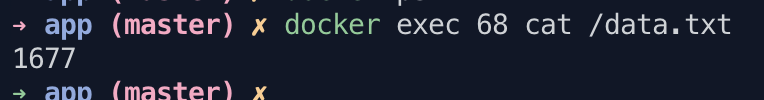


3. 이제 다른 `ubuntu` 컨테이너를 시작하면 동일한 파일이 없다는 것을 알 수 있다.

    ```bash
    docker run -it ubuntu ls /
    ```

    data.txt 는 첫 번째 컨테이너의 스크래치 공간에만 쓰여졌다.


## Container volume

컨테이너에서의 파일 생성, 업데이트, 삭제가 가능하긴 하지만 컨테이너가 제거되었을 때 모든 변경 사항을 잃게 된다. 볼륨을 사용하면 변경할 수 있다.

[볼륨](https://docs.docker.com/storage/volumes/)은 컨테이너의 특정 파일시스템 경로를 다시 host 머신으로 연결하는 기능을 제공한다. 컨테이너의 디렉토리가 마운트되면, 디렉토리의 변경사항들은 host machine 에서도 표시된다. 만약 컨테이너가 다시 시작될 때 같은 디렉토리를 마운트하면 같은 파일이 표시된다.

볼륨에는 두 가지의 타입이 있다. volume mount 부터 시작!

### Persist the todo data

기본적으로 todo app 은 컨테이너 파일시스템에서  /etc/todos/todo.db라는 SQLite db 에 데이터를 저장한다.

db 는 single file 이 되고, 만약 우리가 host 에서 파일을 유지하고 다음 컨테이너가 사용할 수 있게 한다면, 마지막 으로 중단된 위치를 알 수 있어야 한다. volume 을 만들고 디렉토리로 저장된 데이터를 attaching( often called mounting) 하는 것은 데이터를 유지할 수 있다. todo.db 에 컨테이너가 쓸 때 volume 의 host 에서도 유지할 수 있다.

volume mount 를 불투명한 버킷이라고 기억해라. 도커는 디스크에 저장된 것을 포함해서 볼륨을 완전히 관리한다. 우리는 volume 의 이름만 기억하면 된다.

1. volume 만들기

    ```bash
    docker volume create todo-db
    ```

2. volume 없이 도는 도커를 `docker rm -f <id>` 로 제거
3. `--mount` option 으로 volume mount 를 특정하고 컨테이너를 실행한다. volume 의 이름과 컨테이너에 마운트 할 곳(`/etc/todos`) 을 지정해준다.  이 곳에 생성된 모든 파일들은 캡쳐된다.

    ```bash
    docker run -dp 3000:3000 --mount type=volume,src=todo-db,target=/etc/todos getting-started
    ```

4. 컨테이너 rm 했다가 동일한 커맨드로 실행하면 추가했던 데이터들이 그대로 남아있다!

    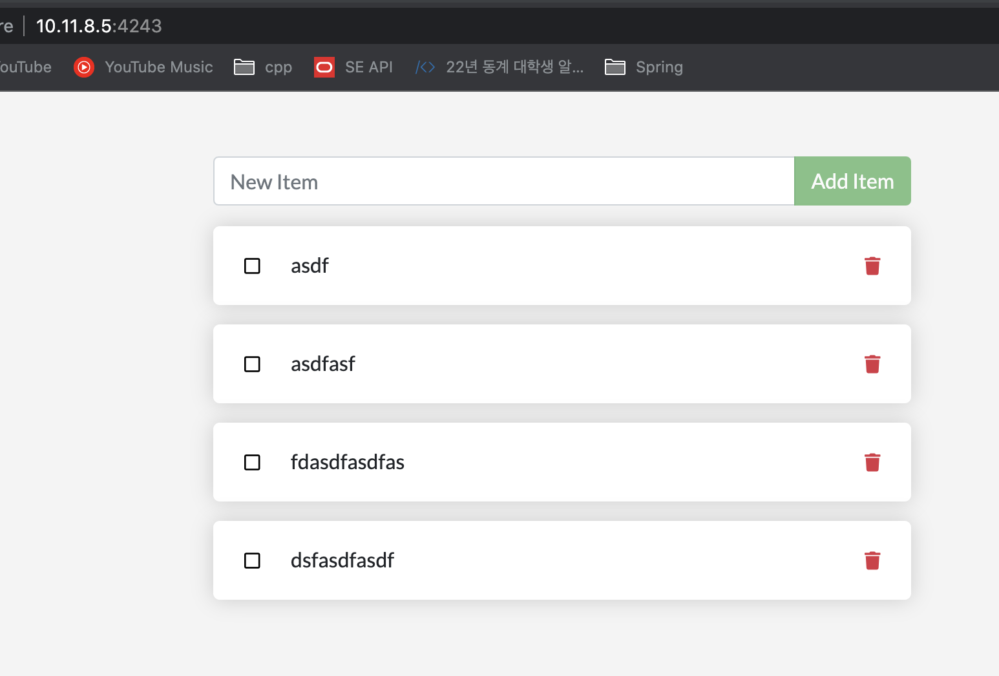


Hooray! You’ve now learned how to persist data!!! so amazing~ incredible~~~~~

## Dive into the volume

“Where is Docker storing my data when I use a volume?”

```bash
docker volume inspect todo-db
```

```json
[
	{
	"CreatedAt": "2023-02-03T20:36:14+09:00",
	"Driver": "local",
	"Labels": null,
	"Mountpoint": "/var/lib/docker/volumes/todo-db/_data",
	"Name": "todo-db",
	"Options": null,
	"Scope": "local"
	}
]
```

`Mountpoint` 는 disk에서 data 가 저장되는 실제 장소이다.

Docker desktop 은 작은 vm 에서 실행되므로 맥에서 확인할 수 없다.

변경 사항 빌드 하는 데 오래거리므로.. 바인드 마운트를 쓰는 것은? 어떠니?!

# Use bind mount

[Use bind mounts](https://docs.docker.com/get-started/06_bind_mounts/)

호스트에서 파일 수정하고 저장하면 변경 사항을 감시해서 적절히 처리하는 프로세스를 컨테이너에서 실행할 수 있다.

## 비교

|  | Named volumes | Bind mounts |
| --- | --- | --- |
| Host location | Docker chooses | You decide |
| Mount example (using --mount) | type=volume,src=my-volume,target=/usr/local/data | type=bind,src=/path/to/data,target=/usr/local/data |
| Populates new volume with container contents | Yes | No |
| Supports Volume Drivers | Yes | No |

### Type out bind mounts

1. app 디렉토리에서 bash 를 ubuntu 컨테이너에서 바인드 마운트

    `docker run -it --mount type=bind,src="$(pwd)",target=/src ubuntu bash`

    - `--mount` 로 바인드 마운트를 만든다. `src` 는 호스트 머신의 현재 디렉토리. `target`은 컨테이너 `/src` 의 내부에 나타나야.. 한다?
2. `src` 디렉토리에서 파일 바꿔보기
    - container 를 시작했을 때 마운트 된 디렉토리이다. getting-started/app 에 있는 파일 처럼 리스팅 함

    호스트

    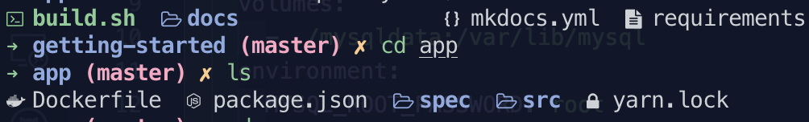

    컨테이너

    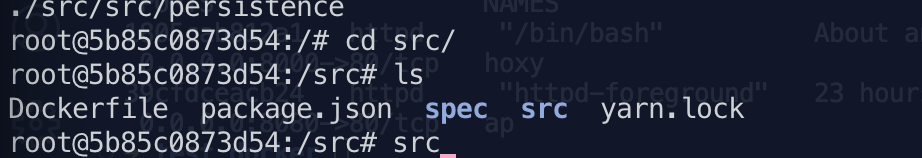

3. 컨테이너에서 파일 생성

    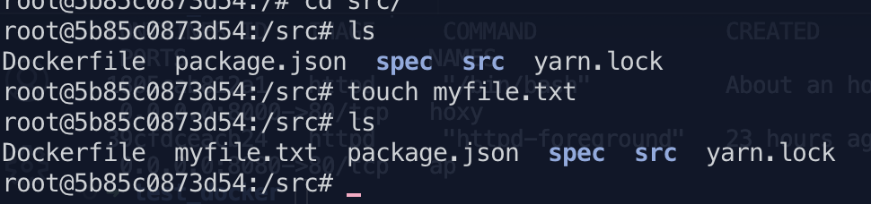

    호스트에도 파일이 생긴다.

    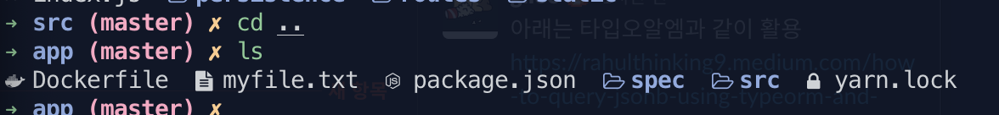


지우는 것도 똑같이 반영됨.


## 마운트 종류

[Manage data in Docker](https://docs.docker.com/storage/)

컨테이너 파일은 기본적으로 writable container layer에 만들어진다.

- 컨테이너 없어지면 데이터 없어짐, 다른 프로세스에서 데이터 가져오는 것이 어려움
- 호스트 시스템에 밀접하게 연결되어 있으므로 다른 곳으로 이동할 수 없다.
- 스토리지 드라이버가 필요하다. Linux 커널로 통합 파일 시스템을 제공하는데 volume 이랑 비교하면 성능 저하가 난다.

호스트 머신의 인메모리에 파일 저장하는 것도 지원하는데 linux 에서는 tmpfs mount 가 사용된다. 윈도우의 경우 named pipe 가 사용된다.

## 마운트 유형 선택


- **볼륨 은** *Docker* ( `/var/lib/docker/volumes/`Linux의 경우)에서 관리 하는 호스트 파일 시스템의 일부에 저장된다. . Docker가 아닌 프로세스는 파일 시스템의 이 부분을 수정하면 안 된다. 볼륨은 Docker에서 데이터를 유지하는 가장 좋은 방법이다.
- **바인드 마운트** 는 호스트 시스템의 *아무 곳에* 나 저장할 수 있다 . 그것이 중요한 시스템 파일이나 디렉토리일 수도 있다. Docker 호스트 또는 Docker 컨테이너의 비 Docker 프로세스도 언제든지 이를 수정할 수 있다.
- **`tmpfs`마운트** 는 호스트 시스템의 메모리에만 저장되며 호스트 시스템의 파일 시스템에는 절대 기록되지 않는다.

### 볼륨

도커에서 생성 및 관리.

볼륨을 생성하면 Docker 의 호스트 디렉토리 내에 저장된다. 컨테이너에 볼륨을 마운트하면 이 디렉토리가 컨테이너에 마운트 된다. 바인드 마운트와 유사하지만 호스트 시스템의 핵심 기능과 격리된다는 점이 다르다.

볼륨을 여러 컨테이너에 동시에 마운트 할 수 있다. `docker volume prune` 으로 사용하지 않는 볼륨을 제거한다. 볼륨은 이름을 지정할 수도, 안할 수도 있다.

볼륨은 volume driver 의 사용도 지원하는데 이는 data 를 원격 호스트, 클라우드 제공자 등등에 저장할 수 있게 한다.

### 바인드 마운트

volume 과 비교하면 제한된 기능을 가진다. 바인드 마운트를 사용하면 호스트머신의 파일 혹은 디렉토리가 컨테이너에 마운트 된다. 파일 혹은 디렉토리는 호스트 머신에서 참조될 수 있다. Docker host 에 파일이 미리 있을 필요가 없다. 없으면 만들어진다. 바인드 마운트는 성능이 뛰어나지만 (performant) 특정 디렉토리 구조를 사용할 수 있는 호스트 시스템의 파일시스템에 의존한다. 새 도커 어플리케이션을 개발한다면 named volume 을 대신 사용하는 편이 좋다. Docker CLI 로 직접 바인드 마운트를 관리할 수 없다.

> 바인드 마운트는 민감한 파일에도 접근할 수 있게 한다.
host 파일시스템을 container의 프로세스에서 변경할 수 있다. 중요 파일들도 생성, 삭제, 변경 할 수 있다. 보안적으로 강력한 능력이고 호스트의 다른 프로세스에도 영향을 미칠 수 있다.
>

### tmpfs 마운트

`tmpfs` 마운트는 디스크에 종속되지 않는다. 컨테이너의 생명주기동안 영구적이지 않거나 중요한 정보를 저장하기 위해 사용한다. 예를 들어 내부적으로 swarm 서비스는 tmpfs 마운트를 사용해서 secret 을 서비스 컨테이너에 마운트한다.

[swarm](https://docs.docker.com/engine/swarm/)  : 도커 내부에서 기본으로 포함하는 서비스.

### named pipes

`npipe` 마운트는 Docker host 와 container 사이의 커뮤니케이션에 사용될 수 있다. 컨테이너 내부에서 서드파티 툴을 실행하거나 docker Engine API 에 연결하는 데 사용된다.

- 진짜 [네임드 파이프](https://learn.microsoft.com/en-us/windows/win32/ipc/named-pipes)임

## Good use cases for volumes

- 여러개의 컨테이너에서 data 를 공유하는 경우. 볼륨을 명확히 생성하지 않으면 처음 컨테이너에 마운트 될 때 생성된다. 컨테이너가 중지되거나 제거되어도 볼륨은 남아있다. 여러 컨테이너에서 동일한 볼륨을 read-write 혹은 read-only 로 동시에 마운트 할 수 있다.
- Docker 호스트가 주어진 directory 혹은 file 구조를 갖도록 보장되지 않는 경우. 볼륨은 컨테이너 런타임에서 호스트의 configuration 을 분리하는 데 도움된다.
- 컨테이너 데이터를 로컬이 아닌 원격 호스트 또는 클라우드 공급자에 저장하려는 경우
- 한 Docker 호스트에서 다른 호스트로 데이터를 백업, 복원, 마이그레이션 하는 경우. volume 을 사용하는 동안 컨테이너를 중지할 수 있고 volume 의 디렉토리를 백업할 수 있다. (`/var/lib/docker/volumes/<volume-name>`)
- Docker Desktop 에서 high-performance I/O 가 필요한 경우. 호스트가 아니고 linux VM 에 저장되므로 r/w 지연이 적고 많이 처리할 수 있다.
- application 이 Docker Desktop 에서 fully native file system behavior 를 필요로 하는 경우. 예를 들어 db 엔진은 트랜잭션 보장을 위해 disk flushing 에 정밀한 컨트롤을 필요로 한다. 볼륨은 linux vm 에 저장되고 이를 보장할 수 있는 반면 bind mount 는 mac이나 window 의 파일시스템(약간 다르게 작동) 에 원격으로 지정된다.


## Good use cases for bind mounts

일반적으로 볼륨을 사용해야 한다.

- 호스트 → 컨테이너로 configuration 파일을 공유하는 경우. 도커가 기본으로 `/etc/resolv.conf` 를 호스트 머신에서 마운트 해서 DNS resolution 을 공유한다.
    - 컨테이너

        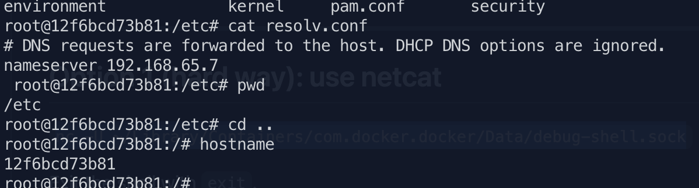

    - docker desktop (nc 로 vm 접속해서 `/etc/resolve.conf` 확인)

        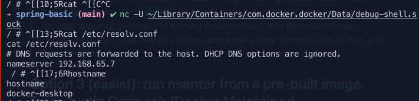

        똑같다

    <details>
    <summary>docker desctop 의 vm 접속하기</summary>
    ### docker desktop vm 접속하기

    [Getting a Shell in the Docker Desktop Mac VM](https://gist.github.com/BretFisher/5e1a0c7bcca4c735e716abf62afad389)

    [How do I access the Docker CE virtual machine on MacOS BigSur?](https://stackoverflow.com/questions/66669224/how-do-i-access-the-docker-ce-virtual-machine-on-macos-bigsur)

    docker 의 debug socket 에 접속한다.

    `stty -echo -icanon && nc -U ~/Library/Containers/com.docker.docker/Data/debug-shell.sock && stty sane`

    - chatGPT 선생의 설명

        This command is for connecting to a Docker container's shell in macOS. Here's what each part of the command does:

        - **`stty -echo -icanon`**: Changes terminal settings to disable echo (hides input from the terminal) and canonical mode (line editing), allowing **`nc`** to receive raw input from the terminal.

            echo 를 없애고 line editing 이 안되게 한다. → nc 가 터미널에서 raw input을 받도록 함.

        - **`nc -U ~/Library/Containers/com.docker.docker/Data/debug-shell.sock`**: Uses **`nc`** (netcat) to connect to the Unix socket located at **`~/Library/Containers/com.docker.docker/Data/debug-shell.sock`**, which provides access to the shell of a running Docker container.

            Unix socket 에 연결.

        - **`stty sane`**: Restores the terminal settings to their default values.

        Note: This command assumes that the Docker engine is running on the local host and that the necessary Unix socket file exists.


    더 이쁘게 나온다 ㅎㅎ

    `-U` : 사용할 유닉스 도메인 소켓 설정

    `stty` :  (set teletype) terminal device 의 interface 옵션을 설정한다.

    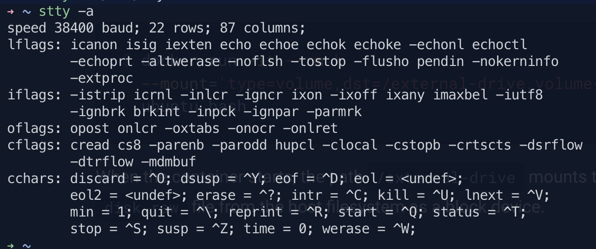


    만든 볼륨들이 가상머신의 `/var/lib/docker/volumes` 에 잘 있다.
    </details>

- 소스 코드나 빌드 아티팩트 를 도커 호스트와 컨테이너의 개발 환경 사이에 공유한다. 예를 들면 Maven `target/` 디렉토리를 컨테이너에 마운트 하면 호스트에서 Maven 을 빌드할 때마다 rebuilt artifacts 에 접근할 수 있다.?

    해당 방법으로 개발하려면 프로덕션 도커파일은 바인드 마운트에 의존하지 않고   production-ready 아티팩트를 이미지에 직접 복사한다.

- 도커 호스트 파일/디렉토리가 컨테이너에 필요한 바인드 마운트와 일관성이 보장되는 경우

## Good use cases for tmpfs mounts

호스트 시스템이나 컨테이너에서 데이터를 유지하지 않으려는 경우.

## 바인드 마운트와 볼륨 사용 주의점

- 파일이나 디렉토리가 있는 컨테이너의 디렉토리에 빈 볼륨을 마운트하면 볼륨으로 파일이나 디렉토리가 복사된다.
- 바인드 마운트 / 비어있지 않은 볼륨을 디렉토리가 있는 컨테이너의 디렉토리에 마운트 하는 경우 파일 혹은 디렉토리들이 마운트로 인해 불명확해진다. 뭔소리?? → 마운트 된 동안 가려져서 액세스 할 수 없다.

# Multiple container apps

각 컨테이너는 한 가지 일만 잘 수행해야 한다. ex) 앱에 mysql 추가 이런거 노노

- DB 와 다르게 API/ front-end 를 확장해야 할 가능성이 높다.
- 별도의 컨테이너를 사용하면 독립적으로 버전 관리 및 업데이트 할 수 있다.
- 로컬에서는 db 를 위한 컨테이너를 사용하지만 프로덕션에서는 관리 서비스를 사용할 수 있다. db 엔진을 앱과 함께 제공하고 싶지 않을것..? 먼 소리지
- 여러 프로세스 실행에는 프로세스 매니저가 필요하므로 (컨테이너는 하나에 한 프로세스만 시작) 컨테이너 시작과 종료에 complexity 가 추가된다.

    

    이케이케 만든다.


## container networking

컨테이너는 기본적으로 같은 머신에 있는 다른 프로세스나 컨테이너를 모르고 독립적으로 실행된다. 따라서 `networking` 으로 통신하게 해줘야 한다.

> 만약 같은 네트워크에 두 컨테이너가 있으면 서로 통신할 수 있다. 아니라면, 할 수 없다.
>

## start MySQL

두 개의 방법을 알아본다. 1. 시작할 때 assign 2. 있는 컨테이너에 연결

```java
docker run -d \
     --network todo-app --network-alias mysql \
     -v todo-mysql-data:/var/lib/mysql \
     -e MYSQL_ROOT_PASSWORD=secret \
     -e MYSQL_DATABASE=todos \
     mysql:8.0
```

자동으로 `todo-sql-data` 라는 볼륨을 만들어준다. 스마트한걸?

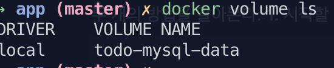

wow

## Connect to MySQL

각 컨테이너에는 고유 IP 주소가 있으므로 컨테이너를 찾을 수 있다.

https://github.com/nicolaka/netshoot → 네트워크 디버깅에 쓰는 컨테이넌데 이걸 써서 파악해보자!

1. nicolaka/netshoot 으로 새 컨테이너 시작 - 동일 네트워크에 연결

    ```bash
    docker run -it --network todo-app nicolaka/netshoot
    ```

2. `dig mysql`

    ```bash
    $> dig mysql

    ; <<>> DiG 9.18.8 <<>> mysql
    ;; global options: +cmd
    ;; Got answer:
    ;; ->>HEADER<<- opcode: QUERY, status: NOERROR, id: 62556
    ;; flags: qr rd ra; QUERY: 1, ANSWER: 1, AUTHORITY: 0, ADDITIONAL: 0

    ;; QUESTION SECTION:
    ;mysql.				IN	A

    ;; ANSWER SECTION:
    mysql.			600	IN	A	172.18.0.2

    ;; Query time: 1 msec
    ;; SERVER: 127.0.0.11#53(127.0.0.11) (UDP)
    ;; WHEN: Tue Feb 07 13:31:10 UTC 2023
    ;; MSG SIZE  rcvd: 44
    ```

    ANSWER SECTION 에서 `A` 레코드를 보면 `172.18.0.2` 이다. (호스트 Ip 와는 다를것)

    `mysql` 으로 이걸 확인할 수 있는 이유는 `--network-alias` 로 지정해줬기 때문이다. Docker 가 mysql 만 보고 ip 를 알 수 있다.

    > Setting Connection Settings via Env Vars :
    production 에서 ENV vars 를 쓰면 안좋다.
    container ochestration framework 가 제공하는 secret 쓰기. 이런 경우 실행되는 컨테이너의 file 로 마운팅 되는 경우가 많음. `_FILE` 같은 것이 그렇다.
    예를 들어서 `MYSQL_PASSWORD_FILE` var 를 지정하면 app 이 참조된 파일에서 connection password 를 가져온다.
    >

    [Why you shouldn't use ENV variables for secret data](https://blog.diogomonica.com//2017/03/27/why-you-shouldnt-use-env-variables-for-secret-data/)

    - 있는 컨테이너에  추가 : `docker network connect [network name] [container name]`

### 연결

1. `mysql` 8.0 이상이면 이렇게 해줘야 함.

    ```bash
    mysql> ALTER USER 'root' IDENTIFIED WITH mysql_native_password BY 'secret';
    mysql> flush privileges;
    ```

2. 컨테이너 올리기

    ```bash
    docker run -dp 3000:3000 \
       -w /app -v "$(pwd):/app" \
       --network todo-app \
       -e MYSQL_HOST=mysql \
       -e MYSQL_USER=root \
       -e MYSQL_PASSWORD=secret \
       -e MYSQL_DB=todos \
       node:18-alpine \
       sh -c "yarn install && yarn run dev"
    ```


# Use Docker Compose

[Use Docker Compose](https://docs.docker.com/get-started/08_using_compose/)

define & share multi-container applications.

YAML 파일을 생성해서 커맨드를 정의하고 모두 spin 하거나 taer down 한다.

Compose 의 큰 장점은 애플리케이션 스택을 파일로 정의하고, 프로젝트 저장소의 루트에 보관하고, 다른 사람이 쉽게 기여할 수 있도록 할 수 있다는 것이다.

## Install Docker Compose

Docker Desktop 이면 이미 설치되어있다. Linux 면 [설치](https://docs.docker.com/compose/install/)해야 한다.

## Create the Compose file

1. app project 의 루트에서 `docker-compose.yml`을 작성한다.
2. compose file 에서 서비스의 목록을 `services:` 로 작성하는 것으로 시작한다.

## Define the app service

```bash
docker run -dp 3000:3000 \
  -w /app -v "$(pwd):/app" \
  --network todo-app \
  -e MYSQL_HOST=mysql \
  -e MYSQL_USER=root \
  -e MYSQL_PASSWORD=secret \
  -e MYSQL_DB=todos \
  node:18-alpine \
  sh -c "yarn install && yarn run dev"
```

이걸 바꿔보자링

1. service entry 와 image 를 정의 한다. 아무 이름이나 설정할 수 있다. name 이 network alias 로 자동 설정 된다.

    ```yaml
    services:
      app:
        image: node:18:alpine
    ```

2. `image` 와 `command` 의 순서는 상관이 없다.

    ```yaml
    services:
      app:
        image: node:18-alpine
        command: sh -c "yarn install && yarn run dev"
    ```

3. `ports` 로 포트 설정하기. 이건 짧은 문법이고 더 자세히 설정할 수도 있음.

    ```yaml
    services:
      app:
        image: node:18-alpine
        command: sh -c "yarn install && yarn run dev"
        ports:
          - 3000:3000
    ```

4. 볼륨 매핑 (얘도 길고 짧은 버전 두 개 있음) 과 working directory 설정

    ```yaml
    services:
      app:
        image: node:18-alpine
        command: sh -c "yarn install && yarn run dev"
        ports:
          - 3000:3000
        working_dir: /app
        volumes:
          - ./:/app
    ```

    volume definition에 상대 경로를 쓸 수 있다

    - volume name 에 `/` 를 넣을 수 있을까? →  없음

        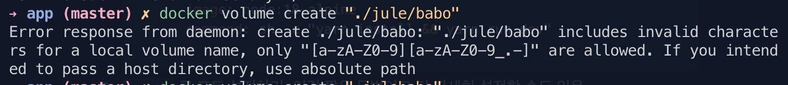

5. environment

    ```yaml
    services:
      app:
        image: node:18-alpine
        command: sh -c "yarn install && yarn run dev"
        ports:
          - 3000:3000
        working_dir: /app
        volumes:
          - ./:/app
        environment:
          MYSQL_HOST: mysql
          MYSQL_USER: root
          MYSQL_PASSWORD: secret
          MYSQL_DB: todos
    ```


- `docker run` 하면 named volume 이 자동 생성 되는데 Compose 에서는 그러지 않는다. `volumes:` 의 top-level 에 볼륨을 지정해준다.

`docker compose up -d` 로 백그라운드 실행

`docker compose down --volumes` 로 볼륨도 제거 가능

# Image-building best practices

[Image-building best practices](https://docs.docker.com/get-started/09_image_best/)

docker scan 으로 보안 취약점을 스캔하는 게 좋다.

[snyk](https://snyk.io/) (서드파티) 랑 제휴함

`docker scan [image_name]`

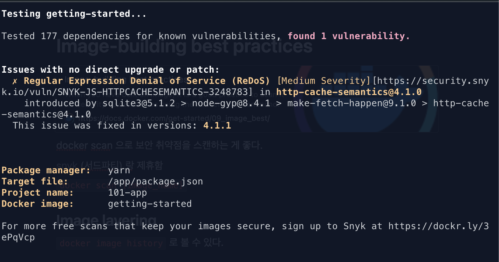

## Image layering

`docker image history` 로 볼 수 있다.

이미지의 각 레이어 생성 시기를 알 수 있음.

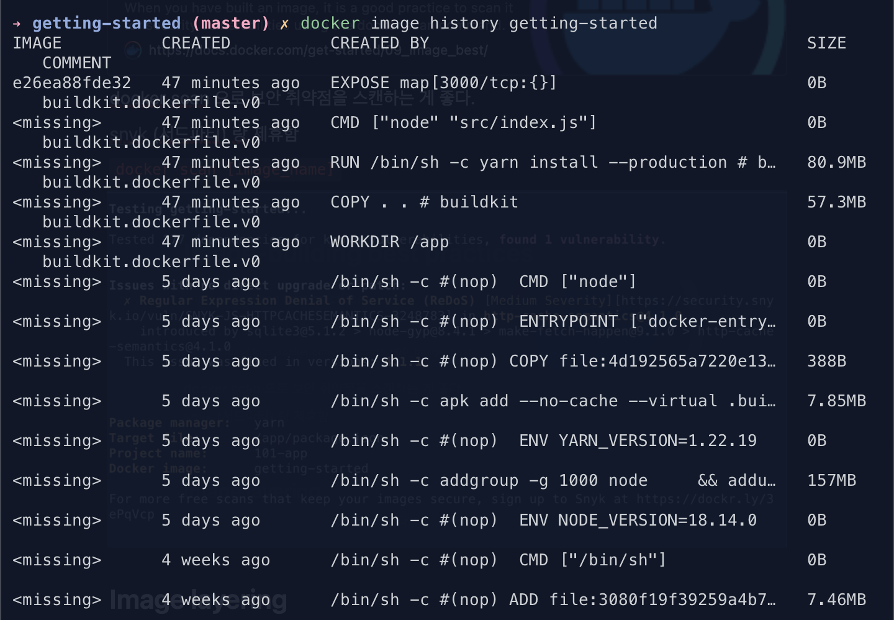

## Layer caching

한 번 레이어가 바뀌면, 아래 레이어들도 다 다시 생성되어야 한다.

```docker
# syntax=docker/dockerfile:1
FROM node:18-alpine
WORKDIR /app
COPY . .
RUN yarn install --production
CMD ["node", "src/index.js"]
```

- 사용 중인 도커파일

Image history 를 다시 보면 각 커맨드가 이미지의 새 레이어가 된다는 것을 알 수 있다. 이미지를 바꿀 때 yarn dependencies 들이 재설치 되어야 한다. 어케 해결함??

**종속성의 캐싱을 지원하도록 Dockerfile 을 재구성해야 한다.** 노드 기반 애플리케이션이면 `package.json` 에 종속성이 저장된다.

1. Docker file 이 `package.json` 을 먼저 복사하고 종속성을 설치한 후 다른 것들을 복사한다.

    ```docker
    # syntax=docker/dockerfile:1
    FROM node:18-alpine
    WORKDIR /app
    COPY package.json yarn.lock ./
    RUN yarn install --production
    COPY . .
    CMD ["node", "src/index.js"]
    ```

2. `.dockerignore` 파일을 Dockerfile 과 같은 폴더에 만든다.
    - `.dockerignores` 파일은 이미지에 관련된 파일만 복사하는 쉬운 방법이다.

        ```docker
        node_modules
        ```

        [Dockerfile reference](https://docs.docker.com/engine/reference/builder/#dockerignore-file)

        - docker CLI 가 docker deamon 으로 가기 전 .dockerignore 를 검사한다. `ADD` 나 `COPY` 를 하지 않는다.
        - go 의 filepath.Match 규칙을 사용한다.

        [Dockerizing a Node.js web app | Node.js](https://nodejs.org/en/docs/guides/nodejs-docker-webapp/)

        세상에 이런 링크가…


    Dockerfile 순서 변경 후 rebuild (12.3s)

    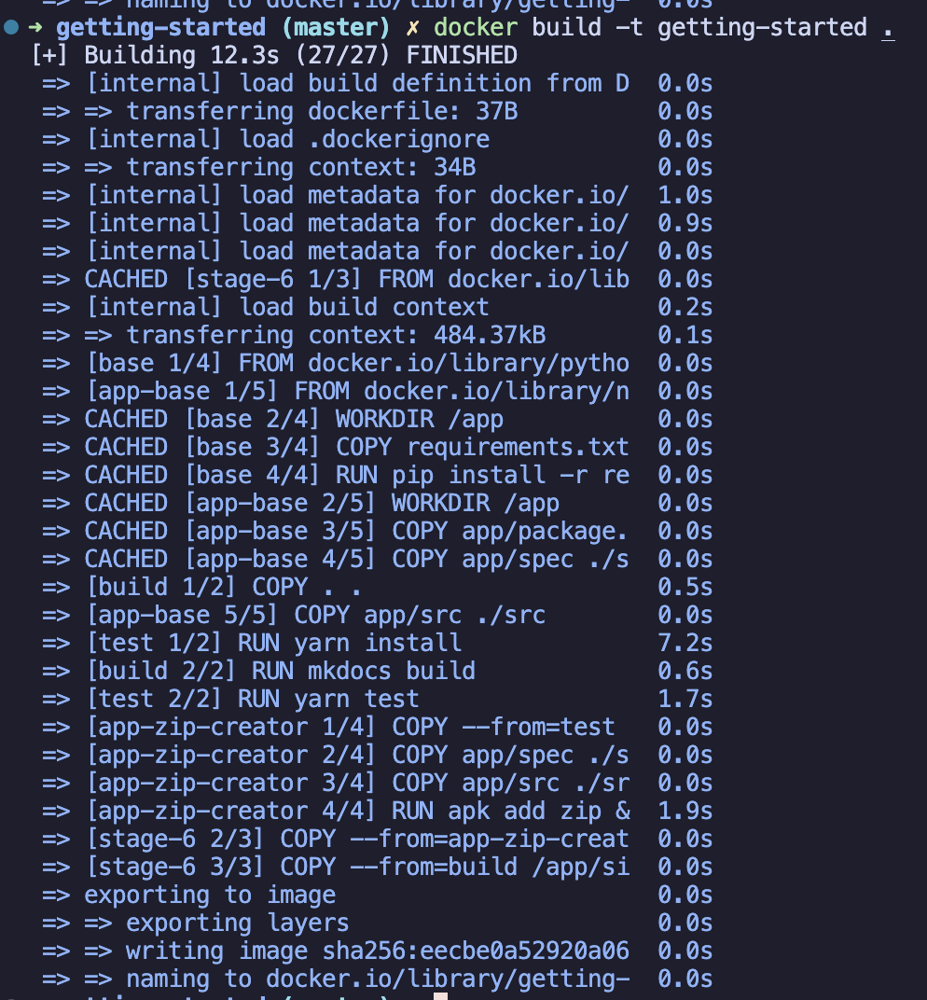

    → 이미지가 캐싱된다.

    바꾸기 전 (19.2s)

    ```docker
    # syntax=docker/dockerfile:1
    FROM node:18-alpine
    WORKDIR /app
    COPY . .
    RUN yarn install --production
    CMD ["node", "src/index.js"]
    EXPOSE 3000
    ```

    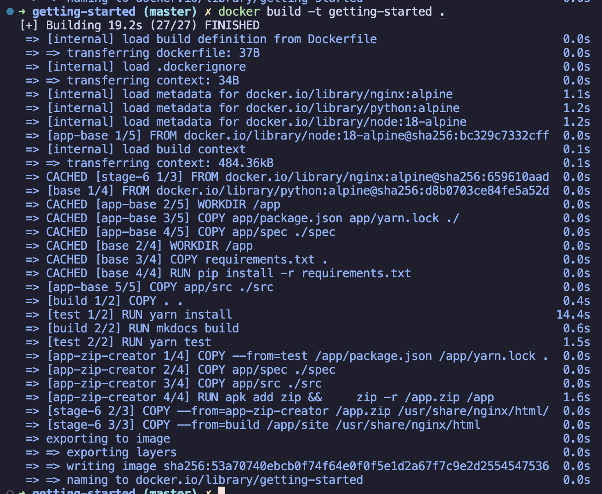

  - 전체 이미지 사이즈를 줄이고 빌드 시간 종속성과 런타임 종속성을 분리해서 최종 컨테이너 보안을 강화한다.

# Docker and OCI Runtime

[Docker and OCI Runtimes](https://medium.com/@avijitsarkar123/docker-and-oci-runtimes-a9c23a5646d6)

이 블로그 게시물의 목적은 OCI( [Open Container Initiative](https://www.opencontainers.org/) )의 다양한 측면 과 Docker가 거기에 어떻게 부합하는지 자세히 알아보는 것입니다.

## OCI

- Open Container Initiative - 컨테이너용 개방형 표준 설계를 위한 Linux Foundation project 프로젝트
- 2015년에 설립됨. 선 도커 후 OCI
- [runtime-spec](https://github.com/opencontainers/runtime-spec), [image-spec](https://github.com/opencontainers/image-spec) 두 가지가 있다.
    - runtime : OCI 이미지를 컨테이너 번들로써 어떻게 실행하는지 정의
    - image : 어떻게 OCI 이미지를 생성는지 정의. (an [image manifest](https://github.com/opencontainers/image-spec/blob/master/manifest.md) , a [filesystem (layer) serialization](https://github.com/opencontainers/image-spec/blob/master/layer.md), and an [image configuration](https://github.com/opencontainers/image-spec/blob/master/config.md).)

## Container Runtimes

- [containerd](https://containerd.io/): [CNCF](https://www.cncf.io/) project. 호스트 시스템의 전체 container 생명주기를 관리한다. (이미지 관리, 스토리지, 컨테이너 생명주기, 관리, 실행, 네트워킹)
- [lxc](https://linuxcontainers.org/) : os 레벨의 가상화를 자체 프로세스와 네트워크 공간이 있는 가상환경에서 제공한다. linux cgroup, namespace 사용한 isolation 제공.
- [runc](https://github.com/opencontainers/runc) : `runc` 는 CLI 툴로 OCI 명세에 따라 컨테이너를 생성하고 실행한다. Docker Inc 가 개발했고 OCI 스펙의 모범같은게  됨
- cri-o, rkt

 컨테이너 런타임은 아래 작업 수행함.

- 컨테이너 이미지 관리
- 라이프 사이클 관리
- 생성
- 리소스 관리

→ rkt 는 모두 다 하는데 containerd 는 일부만 하고 하위 수준은 runc 에 맡긴다.

도커 1.11.0 이전은 모놀리식이어서 도커 엔진이 모든 관리 했음.


- 저수준 컨테이너 런타임 기능 → 모두 runc 가 관리 (최초의 런타임 사양 참조 구현)
- runc 를 containerd 가 감독함. OCI 번들 시작과 생명 주기 관리를 완전히 지원
- 도커가 쓴 [runc](https://www.docker.com/blog/runc/) 포스팅, [containerd](https://www.docker.com/blog/docker-containerd-integration/) 포스팅
    - containerd API 는 gRPC 로 빌드됨. OCI 번들 경로와 컨테이너 ID 를 제공하면 API 호출. 상태를 최소화하고 디스크에서 컨테이너 런타임 상태 분리함.

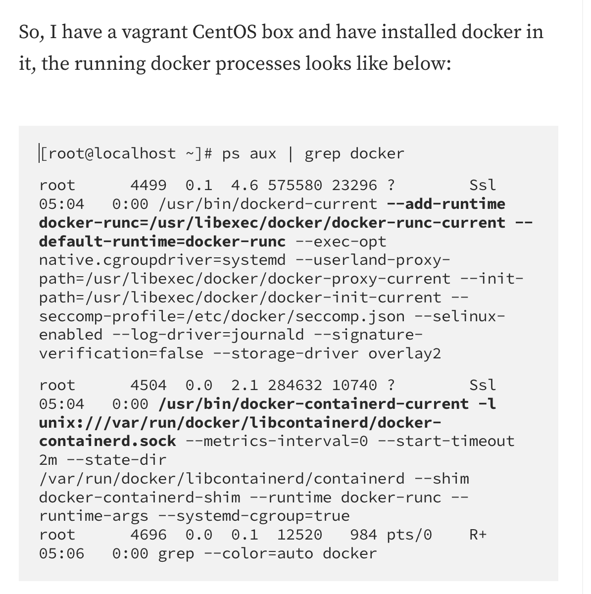

나도 해봄

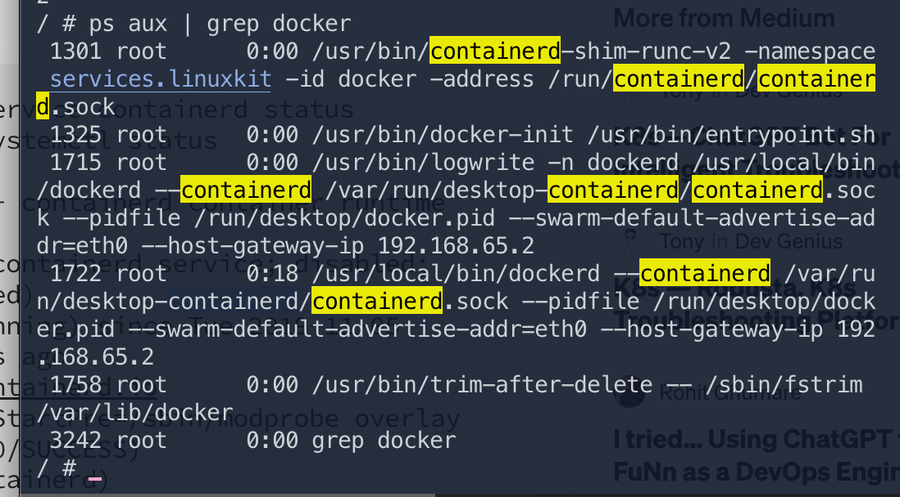

containerd 를 설치하면 세 커맨드가 깔린다.

- runc : run container
- ctr: containerd CLI - 이걸로 containerd 와 interact 가능
- `containerd-shim` : daemonless containers 지원
- Download image with ctr
    - what is ctr?

        ctr is an unsupported debug and administrative client for interacting
        with the containerd daemon. Because it is unsupported, the commands,
        options, and operations are not guaranteed to be backward compatible or
        stable from release to release of the containerd project.


    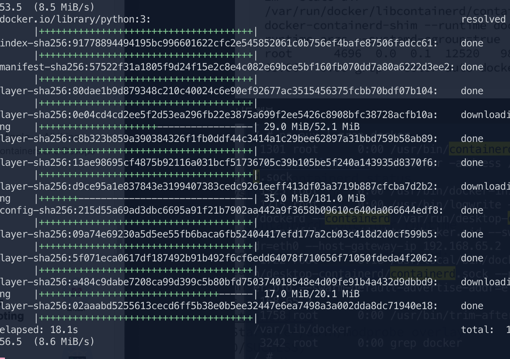

- ls

    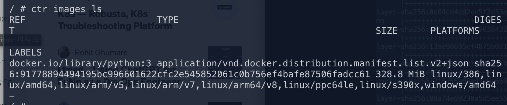


`ctr run -d` 는 권한이 없다고 못함..

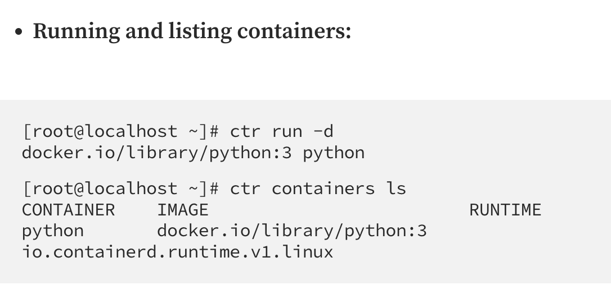

암튼 해보면 `runc` 가 컨테이너를 돌리고 있다.

- container-shim 은 기본적으로 컨테이너 프로세스들의 부모이다.
- 런타임 (`runc` 같은 것) 을 허용하고 컨테이너가 실행되면 런타임을 종료시킨다. 이것 때문에 컨테이너에 긴 런타임이 없는 것이다.
- 컨테이너의 exit 상태를 더 높은 레벨의 도구 (docker 같은거) 에 보내서 관리한다. 이 때 컨테이너 프로세스에 실질적 부모는 없어도 됨.

이건 아래 커맨드로 증명할 수 있다. `runc` 없이 실행되는 `containerd` 를 볼 수 있다. 대신 containerd-shim 이 실행된다.

```java
[root@localhost ~]# ps aux | grep containerd
root     24742  2.3  8.0 492276 40096 ?        Ssl  05:47   0:28 /usr/local/bin/containerd
root     24829  0.0  0.7 109100  3940 ?        Sl   06:01   0:00 containerd-shim -namespace default -workdir /var/lib/containerd/io.containerd.runtime.v1.linux/default/python -address /run/containerd/containerd.sock -containerd-binary /usr/local/bin/containerd
```

### runc 갖고놀기

`container-shim` 으로 `runc` 를 사용하므로 runc 는 컨테이너만으로 실행할 수 있음. OCI image-spec 에 기반하는 (컨테이너 이미지의 루트 파일 시스템의 `config.json` 에 있다) 번들만 있으면 가능하다.

```
t[root@localhost rootfs]# mkdir -p alpine/rootfs
[root@localhost rootfs]# cd alpine
[root@localhost alpine]# docker export $(docker run -d alpine) | tar -C rootfs -xv
```

tarball 로 docker alpine 이미지를 추출함. tarball 로 추출하면 alpine 이미지의 root file system 을 추출할 수 있다.

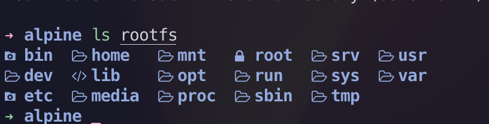

아 근데 이걸 맥에서 추출할 수는 있는데 ..runc 가 없어서 망 ㅎㅎ

```
[root@localhost alpine]# runc spec
[root@localhost alpine]# cat config.json
{
 "ociVersion": "1.0.1-dev",
 "process": {
  "terminal": true,
  "user": {
   "uid": 0,
   "gid": 0
  },
  "args": [
   "sh"
  ],
  "env": [
   "PATH=/usr/local/sbin:/usr/local/bin:/usr/sbin:/usr/bin:/sbin:/bin",
   "TERM=xterm"
  ],
  "cwd": "/",
  ...
  ...
  "readonlyPaths": [
   "/proc/asound",
   "/proc/bus",
   "/proc/fs",
   "/proc/irq",
   "/proc/sys",
   "/proc/sysrq-trigger"
  ]
 }
}
```

이렇게 해서 config 추출하고 실행할 수 있다.

```
[root@localhost alpine]# runc run alpine-container
/ #
/ #
/ # pwd
/
/ # echo "runc started this container using the rootfs of alpine"
runc started this container using the rootfs of alpine
/ #
```

config.json 에서 sh 를 기본 실행하므로 sh 접속.

OCI 컨테이너 런타임은 최소 사양만 갖추면 매우 유연하다. 도커는 더 이상 단일체가 아니고 `containerd` 와 `runc` 를 런타임에 이용한다.

`containerd` 는 컨테이너 생태계에서 도커 없이, (쿠버네티스의 `cri-o` 같은 것)  컨테이너 런타임을 가질 수 있게 한다!
