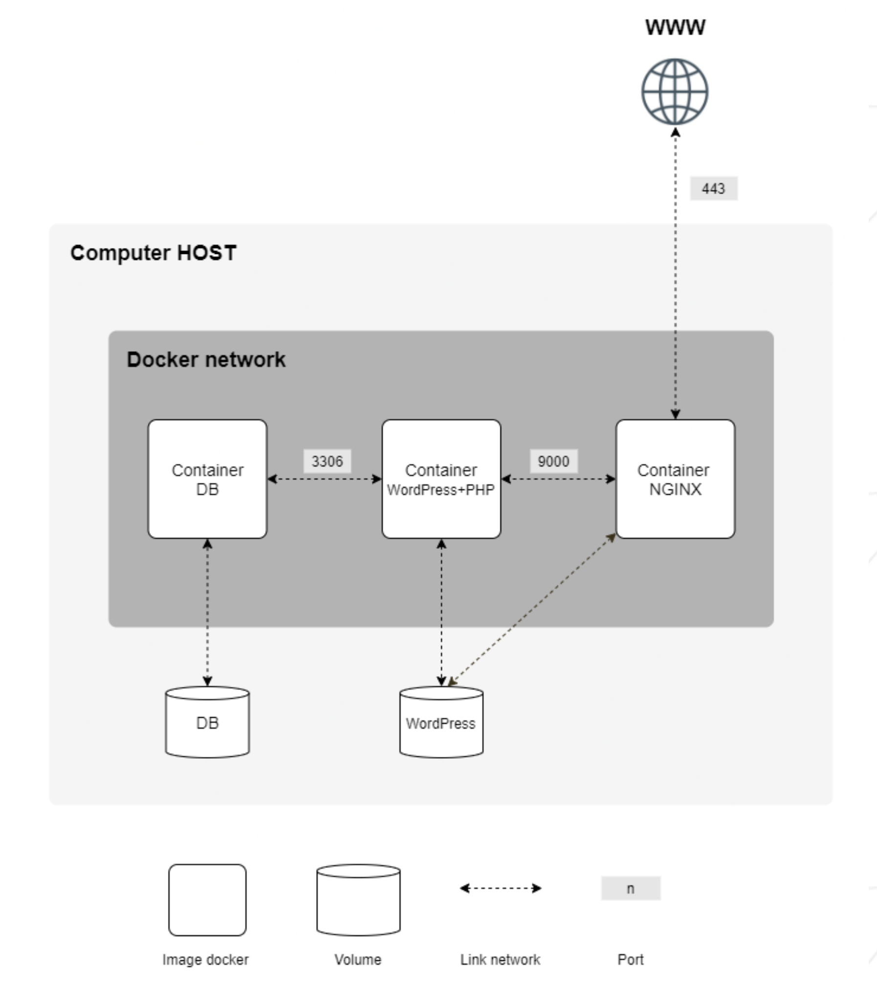

Summary : This document is a System Administration related exercise.

# Introduction

이 프로젝트는 Docker 를 사용하여 system administration (시스템 관리) 에 대한 지식을 넓히는 것을 목표로 한다. 여러 개의 Docker 이미지를 가상화하고, 새 개인 가상 머신에서 이미지를 만들 것이다.

# General guidelines

- 이 프로젝트는 Virtual Machine 에서 완성되어야 한다.
- 설정에 필요한 모든 파일은 `srcs` 폴더에 위치해야 한다.
- `Makefile` 또한 필요하며, directory 의 루트에 위치해야 한다. 그것은 반드시 전체 애플리케이션을 설정해야 한다. (i.e. `docker-compose.yml` 을 이용하여 Docker 이미지들을 빌드해야 한다.)
- 이 subject 는 아직 배우지 않은 개념을 실제로 수행해야 한다. 그러므로, Docker 사용법에 관한 많은 문서들과 과제에 도움이 될만한 다른 문서들을 읽는 것이 좋을 것이다.

# Mandatory part

이 프로젝트는 특정 규칙에 따라 다른 서비스들로 구성된 작은 infrastructure 를 셋업하는 것으로 구성되어있다. 전체 프로젝트는 가상 머신 안에서 완료되어야 한다. **`docker compose`** 를 사용해야 한다.

각 Docker 이미지는 반드시 해당하는 서비스와 같은 이름을 가져야 한다. 각 서비스는 전용(dedicated) 컨테이너 안에서 실행되어야 한다.

perfomance 문제 때문에, 컨테이너는 Alpine 혹은 Debian 의 두 번째(penultimate) stable 버전에서 빌드되어야 한다. 선택은 당신의 몫이다!

서비스 하나마다 너만의 `Dockerfiles` 도 작성해야 한다. `Dockerfile` 들은 `Makefile` 에 의해 `docker-compose.yml` 안에서 호출되어야 한다.

그것은 네 프로젝트의 도커 이미지들을 스스로 빌드해야 한다는 것을 의미한다. 또한 이미 만들어진 Docker 이미지들과 DockerHub 같은 서비스들을 사용하는 것은 금지된다. (Alpine/Debian 은 제외)

다음을 설정해야 한다. :

- **NGINX** - TLSv1.2 혹은 TLSv1.3 만 허용됨 - 을 포함하는 Docker container
- nginx 없이 **WordPress + php-fpm** (반드시 설치 및 설정 되어야 한다.) 만 포함하는 Docker container
- nginx 없이 **MariaDB** 만 포함하는 Docker container
- **WordPress database** 를 포함하는 volume.
- **WordPress website** 파일들을 포함하는 두 번째 volume.
- 컨테이너 간의 connection 을 설립하는 **`docker-network`**.

컨테이너들은 crash 가 나면 restart 해야 한다.

> ℹ️ Docker container 는 가상 머신이 아니다. 따라서 실행하려고 할 때 ‘tail -f’ 등에 기반한 hacky patch 를 사용하는 것은 추천하지 않는다. deamon 이 어떻게 작동하는 지와 그것을 쓰는 것이 좋은지에 대해 알아봐라.


> 🚫 당연히! 네트워크 사용 : host or --link or links : 는 금지된다. 네트워크 라인은 docker-compose.yml 파일에 표시되어야 한다. 컨테이너는 무한루프를 실행하는 커맨드로 시작하면 안된다. 따라서, entrypoint 로 사용되거나 entrypoint script 안에서 사용되는 모든 커맨드에도 적용된다. 다음은 금지되는 hacky patches 이다 : tail -f, bash, sleep infinity, while true.


> ℹ️ PID 1 에 대해서와 Dockerfiles 를 작성하는 좋은 예시에 대해 읽어봐라.


- WordPress database 안에서 두 사용자가 있어야 한다. 하나는 관리자(administrator) 가 되어야 한다. 관리자의 username 은 admin/Admin 혹은 administarator/Administartor 를 포함할 수 없다. (admin, administrator, Adminiatrator, admin-123 등등도 안된다.)


> ℹ️ 볼륨은 Docker 를 이용한 호스트 머신의 /home/login/data 폴더에서 사용할 수 있다. 당연히, login을 네 것으로 교체해야 한다.

간단히 하려면, 네 domain name 을 설정하고 그것이 너의 local IP 주소를 가리켜야 한다.

이 domain name 은 [login.42.fr](http://login.42.fr) 이어야 한다. 다시 말해, 너만의 login 을 사용해야 한다.

예를 들어서 만약 로그인이 wil 이라면, [wil.42.fr](http://wil.42.fr) 은 wil 의 웹사이트를 가리키는 IP 주소로 리다이렉트 되어야 한다.

> 🚫 ‘lastest’ tag (image-name:latest) 는 금지된다.
어떤 password도 Dockerfiles 에 있으면 안된다.
환경변수를 사용하는 것은 mandatory 이다.
또한, 환경변수를 저장하기 위해 .env 를 사용하는 것이 강력히 추천된다. .env 파일은 srcs 디렉토리의 root 에 위치해야 한다.
네 NGINX 컨테이너는 TLSv1.2 혹은 TLSv1.3 프로토콜을 이용하여 443 포트를 통한 infrastructure 로 통하는 entrypoint 에만 존재해야 한다.


예상되는 결과의 diagram 은 다음과 같다. :


예상 directory 구조의 예시는 다음과 같다. :

```cpp
$> ls -alR
total XX
drwxrwxr-x 3 wil wil 4096 avril 42 20:42 .
drwxrwxrwt 17 wil wil 4096 avril 42 20:42 ..
-rw-rw-r-- 1 wil wil XXXX avril 42 20:42 Makefile
drwxrwxr-x 3 wil wil 4096 avril 42 20:42 srcs

./srcs:
total XX
drwxrwxr-x 3 wil wil 4096 avril 42 20:42 .
drwxrwxr-x 3 wil wil 4096 avril 42 20:42 ..
-rw-rw-r-- 1 wil wil XXXX avril 42 20:42 docker-compose.yml
-rw-rw-r-- 1 wil wil XXXX avril 42 20:42 .env
drwxrwxr-x 5 wil wil 4096 avril 42 20:42 requirements

./srcs/requirements:
total XX
drwxrwxr-x 5 wil wil 4096 avril 42 20:42 .
drwxrwxr-x 3 wil wil 4096 avril 42 20:42 ..
drwxrwxr-x 4 wil wil 4096 avril 42 20:42 bonus
drwxrwxr-x 4 wil wil 4096 avril 42 20:42 mariadb
drwxrwxr-x 4 wil wil 4096 avril 42 20:42 nginx
drwxrwxr-x 4 wil wil 4096 avril 42 20:42 tools
drwxrwxr-x 4 wil wil 4096 avril 42 20:42 wordpress

./srcs/requirements/mariadb:
total XX
drwxrwxr-x 4 wil wil 4096 avril 42 20:45 .
drwxrwxr-x 5 wil wil 4096 avril 42 20:42 ..
drwxrwxr-x 2 wil wil 4096 avril 42 20:42 conf
-rw-rw-r-- 1 wil wil XXXX avril 42 20:42 Dockerfile
-rw-rw-r-- 1 wil wil XXXX avril 42 20:42 .dockerignore
drwxrwxr-x 2 wil wil 4096 avril 42 20:42 tools
[...]

./srcs/requirements/nginx:
total XX
drwxrwxr-x 4 wil wil 4096 avril 42 20:42 .
drwxrwxr-x 5 wil wil 4096 avril 42 20:42 ..
drwxrwxr-x 2 wil wil 4096 avril 42 20:42 conf
-rw-rw-r-- 1 wil wil XXXX avril 42 20:42 Dockerfile
-rw-rw-r-- 1 wil wil XXXX avril 42 20:42 .dockerignore
drwxrwxr-x 2 wil wil 4096 avril 42 20:42 tools
[...]

$> cat srcs/.env
DOMAIN_NAME=wil.42.fr
# certificates
CERTS_=./XXXXXXXXXXXX
# MYSQL SETUP
MYSQL_ROOT_PASSWORD=XXXXXXXXXXXX
MYSQL_USER=XXXXXXXXXXXX
MYSQL_PASSWORD=XXXXXXXXXXXX
[...]
$>
```

# Bonus part

이 프로젝트에서 보너스 파트가 목표하는 바는 간단하다.

Dockerfile 은 반드시 각 extra service 에 대해 작성되어야 한다. 따라서 각 파일들은 각 컨테이너 안에서 실행되어야 하고, 필요하다면 dedicated volume 을 가져야 한다.

Bonus list:

- WordPress website 의 cache 를 적절히 관리하기 위해 **redis cache** 를 설정해야 한다.
- WordPress website 의 볼륨을 가리키는 **FTP server** 를 설정해야 한다.
- PHP 를 제외한 언어를 선택해서 간단한 **static website** 를 만들어라. 예를들어, 이력서를 보여주는 사이트나 쇼케이스 사이트..
- **`Adminer`** 를 설정해야 한다.
- **유용하다고 생각되는 서비스를 선택하여 설정**해야 한다. 디펜스에서 당신의 선택을 정당화해야 한다.

> ℹ️ bonus part 를 완료하기 위해, extra service 를 설정할 수 있다. 이 경우 필요에 맞게 더 많은 포트를 열 수 있다.

> 🚫 보너스 파트는 맨데토리 파트가 완벽할 때만 평가된다. 완벽하다는 것은 맨데토리 파트가 전체적으로 완료되었고 오작동 (malfunctioning) 없이 잘 동작함을 의미한다. 만약 모든 맨데토리 요구사항을 통과하지 못했다면 보너스 파트는 평가될 수 없다.
