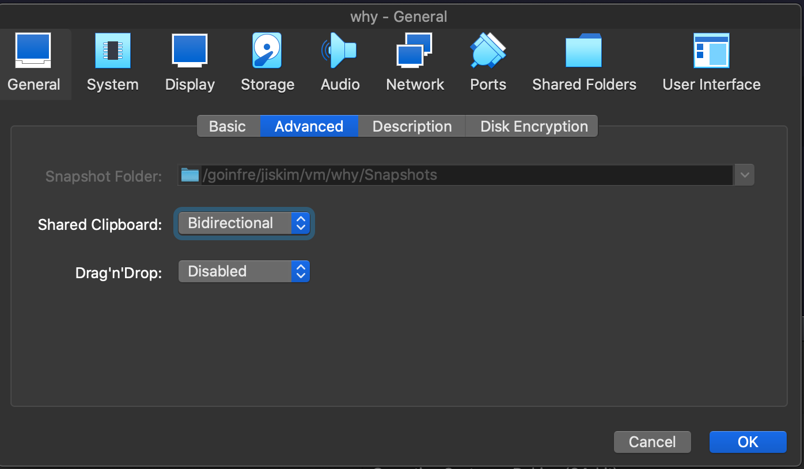
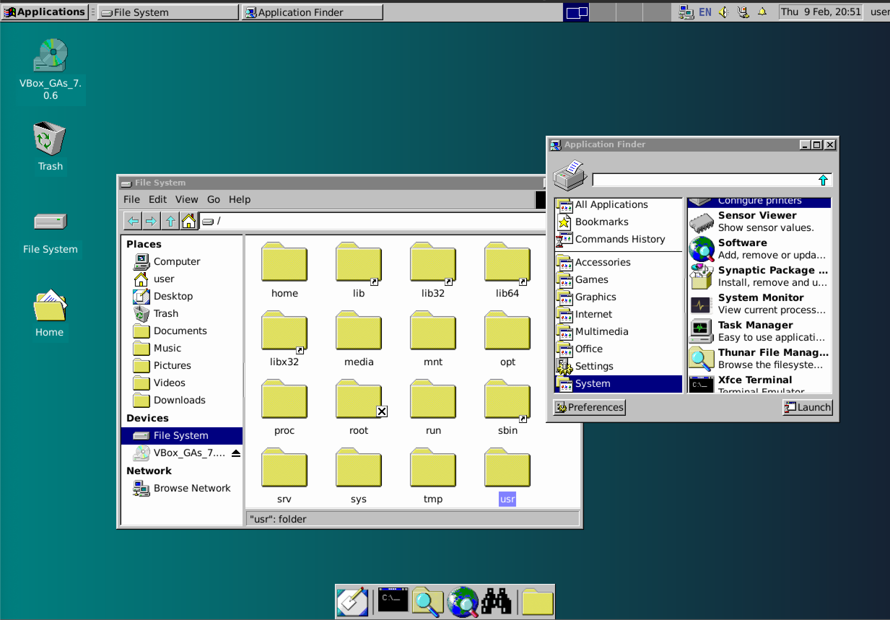

# Settings for the VM
- os : debian-11
## 패키지 설치
`su -` 로 루트 계정에서 진행한다.
- `visudo`
  - `username ALL=(ALL) NOPASSWD:ALL` 추가
  - `NOPASSWD` 로 `sudo` 커맨드 사용 시 패스워드를 입력하지 않아도 된다.
- `apt-get update`
- `apt-get install -y git vim sudo curl fonts-nanum`
  - fonts-nanum : 한글 폰트 설치

## 호스트 머신과 클립보드 공유

refs : [How do I enable copy and paste between VirtualBox and host?](https://linuxhint.com/enable-copy-paste-virtualbox-host/)

1. Insert Guest Addition CD Image
    - guest addition 을 이용한 기능이므로 os 설치 단계에서 추가할 수 있어 보이지만 테스트 해보지 않았음.
    - 설치 다시 할 때 테스트 해보는 것으로..

    ```bash
    $ sudo apt install build-essential dkms linux-headers-$(uname -r)
    ```
    .. 해당 방식이 작동하지 않는 경우 직접 cdrom 마운트 후 스크립트로 설치한다.
    - `sudo mkdir -p /mnt/cdrom`
    - `sudo mount /dev/cdrom /mnt/cdrom`
    - `sudo /mnt/cdrom/VBoxLinuxAdditions.run`
2. 머신 설정 변경
    
    - Shared Clipboard 를 Bidirectional 으로 변경한다.
3. reboot

## GUI 테마 Windows95 로 만들기
1. debian 설치 시 GUI 환경을 _xfec4_ 로 선택한다.
    - 이미 다른 툴을 설치했다면
    - `sudo apt update && sudo apt upgrade`
    - `sudo apt install tasksel -y`
    - `sudo tasksel install xfce-desktop` 로 설치한다.
2. [Chicago95](https://github.com/grassmunk/Chicago95) 테마 설치
    - `git clone https://github.com/grassmunk/Chicago95` && `cd Chicago95`
    - `python3 installer.py`
3. `reboot`
4. 적용된 모습
    
## oh-my-bash 설치
1. `sh -c "$(curl -fsSL https://raw.githubusercontent.com/ohmybash/oh-my-bash/master/tools/install.sh)"`
2. Chicago95 theme 이식
    - `Chicago95/Extras/Chicago95.zsh-theme` 파일을 `~/.oh-my-bash/themes/Chicago95/Chicago95.theme.sh` 로 이동 && 이름 변경
    - `mkdir -p ~/.oh-my-bash/themes/Chicago95`
    - `cp -r ~/Chicago95/Extras/Chicago95.zsh-theme ~/.oh-my-bash/themes/Chicago95/Chicago95.theme.sh`
3. `~/.bashrc` 수정
    - `OSH_THEME="Chicago95"`
4. `source ~/.bashrc`
5. theme file 삭제 (Optional)
    - `sudo rm -rf ~/Chicago95`
이상하면? Chicago 95 reinstall 을 갈겨보자..

## Docker 설치
1. `apt` 가 HTTPS 를 지원하도록 패키지 설치
``` bash
sudo apt-get update
sudo apt-get -y install ca-certificates curl gnupg lsb-release
```
- 위 과정 이후 이미 설치되어 있었음.

2. Docker GPG key 추가
``` bash
sudo mkdir -m 0755 -p /etc/apt/keyrings
curl -fsSL https://download.docker.com/linux/debian/gpg | sudo gpg --dearmor -o /etc/apt/keyrings/docker.gpg
```

3. set up repository
``` bash
echo \
"deb [arch=$(dpkg --print-architecture) signed-by=/etc/apt/keyrings/docker.gpg] https://download.docker.com/linux/debian \
$(lsb_release -cs) stable" | sudo tee /etc/apt/sources.list.d/docker.list > /dev/null`
```
4. 권한 설정
``` bash
sudo chmod a+r /etc/apt/keyrings/docker.gpg
sudo apt-get update
```

5. 설치
``` bash
sudo apt-get -y install docker-ce docker-ce-cli containerd.io docker-buildx-plugin docker-compose-plugin
```

6. docker group 에 사용자 추가
``` bash
sudo usermod -aG docker $USER
newgrp docker
```
